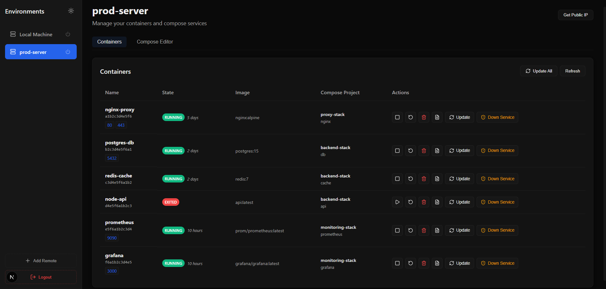
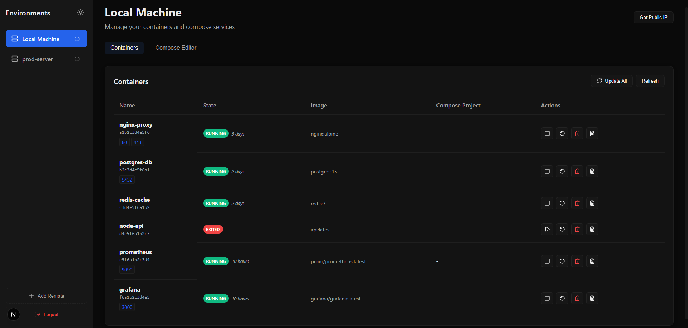
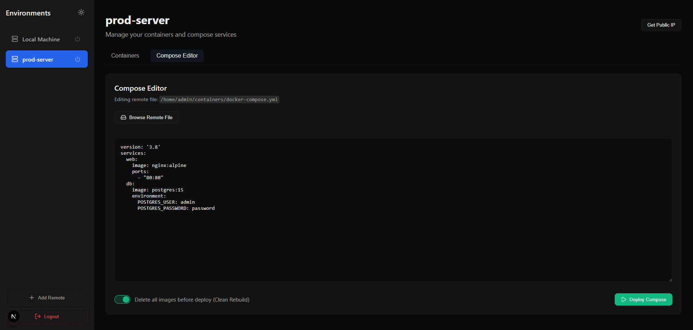
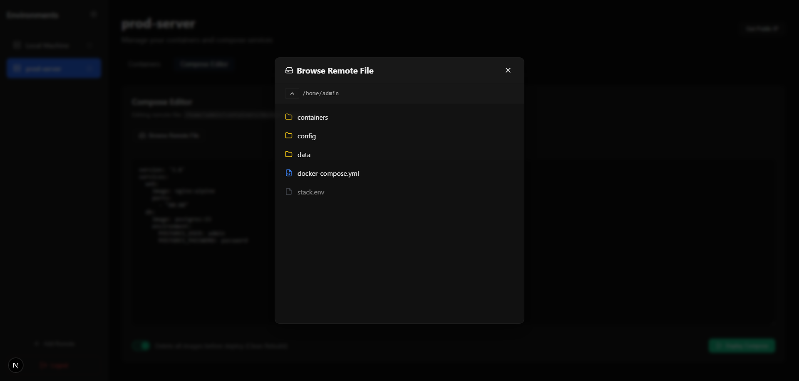
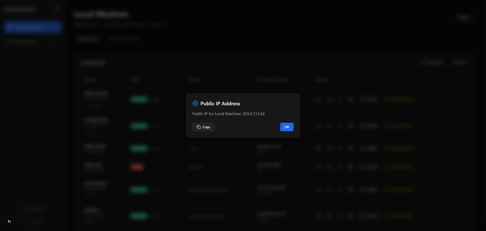
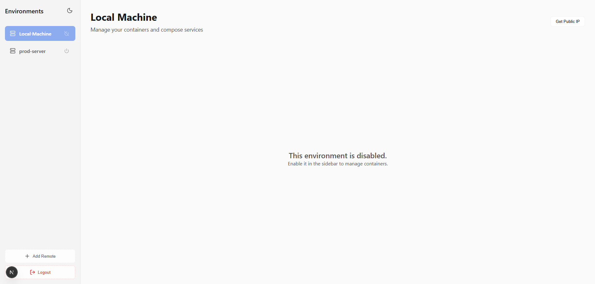
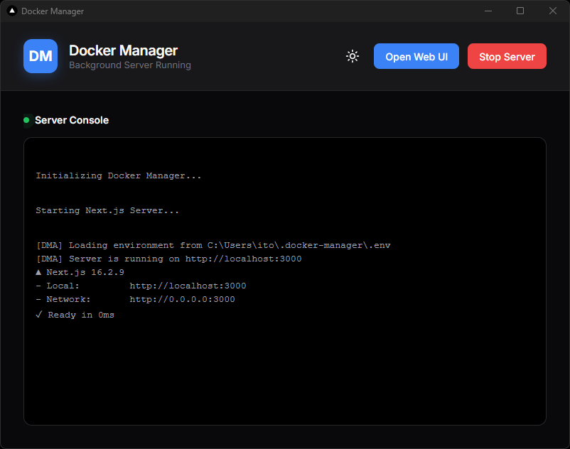
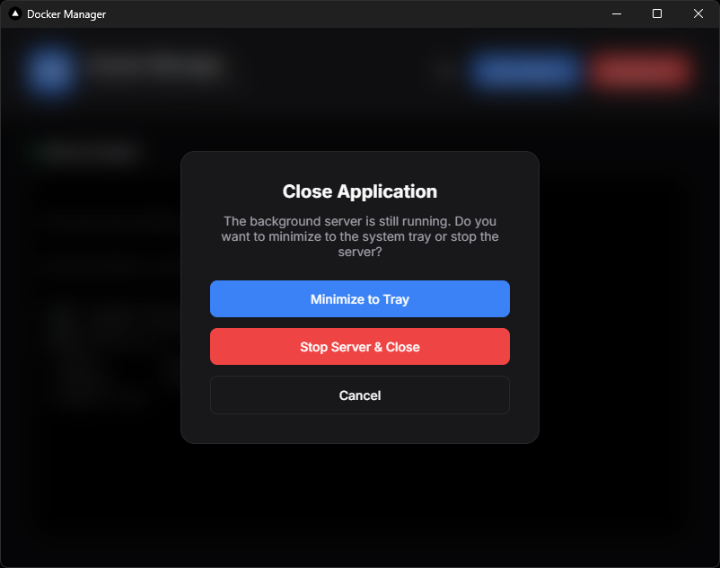

<div align="center">
  <h1>🐳 DMA (Docker Manager App)</h1>
  <p><strong>Your containers. Tamed, managed, securely protected, and beautifully visualized on your Desktop.</strong></p>
</div>

---

## 🚀 Welcome to DMA

Are you tired of typing `docker ps` and squinting at your terminal to figure out which randomly generated name belongs to your crucial database? Welcome to **DMA (Docker Manager App)**! We bring order to the chaos of containerization with a sleek, modern desktop application.

Built on the robust combination of **Tauri** and **Next.js**, DMA allows you to seamlessly manage your local and remote Docker environments from a standalone, ultra-fast native desktop app—no terminal or manual configuration files required.

## ✨ Features

- **💻 Native Desktop Experience**: Powered by Tauri, enjoy a lightweight, blazing-fast native application that lives in your system tray.
- **✨ Native Setup Wizard**: Create your administrator credentials and configure a custom server port right from the desktop window on the very first launch. The background web server securely waits to boot until you've customized your setup—no manual `.env` file editing required!
- **🛒 App Store Templates**: Explore the built-in library to effortlessly deploy popular services (like Pi-hole, Jellyfin, Nextcloud, and more) with a single click.
- **🔌 Multi-Environment (Local & Remote)**: Connect to your local Docker socket or manage remote servers securely over SSH (`node-ssh`).
- **📊 Interactive Dashboard**: Real-time overview of containers, resource usage, and precise **uptime tracking** across all your environments.
- **🌐 Network & IP Management**: Quickly view active ports and **open them directly in new browser tabs**. The app also securely fetches and displays the remote server's **Public IP address** on the fly (never permanently stored).
- **🛑 Advanced Container Management**: 
  - Stop, restart, or completely delete individual containers.
  - **Live Stat Monitoring**: View real-time CPU and memory usage statistics for running containers.
  - **Pull new images** for individual items to seamlessly update your services, complete with **new version notifications** indicating when an update is available.
- **🛠️ Compose Project Control**: Take control of entire application stacks! **Bring down or spin up an entire project** (all containers) simultaneously with a single click.
- **📝 Live Compose Editor**: A built-in code editor to view and modify your `docker-compose.yml` files. Make your changes, save, and immediately restart the compose stack right from the editor!
- **📜 Log Viewer & Command Executor**: Instantly view, stream, and copy container logs. Plus, a built-in terminal executor lets you rapidly send shell commands straight to the container without ever leaving the UI.
- **📂 Compose File Discovery**: Effortlessly navigate your server's directories to locate and import existing `docker-compose.yml` projects without dropping into an SSH connection. (Selections are instantly saved to your environment in the background).
- **⚙️ Dynamic Server Settings**: Instantly tweak UI settings (like debug logging or starting minimized in the tray) on the fly. The backend server smartly reboots itself only when core networking or credentials change.
- **📱 Fully Mobile-Responsive Design**: Manage your containers, compose environments, and server settings smoothly from any device. The UI seamlessly adapts to phones and tablets without sacrificing functionality.
- **🔗 Advanced Network Operations**: Effortlessly create, view, and delete Docker networks on your local or remote machine directly from the intuitive Networks tab.
- **🔔 Background Notifications**: Get native system notifications for container state changes, background tasks, and critical failures, keeping you informed even when the app is minimized.

### 🖼️ Gallery

**Remote Server Management (Dark Mode)**
*Manage your remote containers securely. The Compose Project column seamlessly groups complex stacks together for easy management.*


**Local Docker Engine (Dark Mode)**
*Connect directly to your local Docker socket. Easily view standalone containers, ports, and precise uptimes at a glance.*


**Live Compose Editor**
*Edit your `docker-compose.yml` files directly in the app. Make changes and instantly restart your entire stack without ever opening a terminal.*


**Remote File Browser**
*Navigate your remote server's filesystem visually. Locate and import existing compose configurations with just a few clicks.*


**Public IP & Network Management**
*Securely fetch and display your server's true Public IP on the fly, alongside active container ports.*


**Environment Management & Light Mode**
*Keep your sidebar tidy by disabling inactive environments. Plus, enjoy a beautifully designed light mode interface for a brighter workspace.*


**Native Desktop Experience**
*A standalone, blazing-fast native application window that completely removes the need for cluttered browser tabs.*


**System Tray Integration**
*Runs quietly in the background. Minimize to your system tray and manage your Docker environments completely out of sight.*


## 🛡️ Enterprise-Grade Security

DMA is built with a defense-in-depth architecture to keep your host machines and containers safe:

- **Strict Input Validation**: All incoming requests are strictly validated using `Zod` schemas to prevent payload manipulation.
- **Command Injection Prevention**: Subprocesses use argument arrays (`execFile`) and strict shell-escaping to completely neutralize command injection risks.
- **Session & CSRF Protection**: Uses stateless, signed JWT sessions (`jose`) with the Synchronizer Token Pattern (CSRF headers) to block cross-site attacks.
- **Step-Up Authentication**: High-risk actions (like the debug shell endpoint) require immediate password re-verification, yielding a short-lived token.
- **Durable Audit Logging**: Critical actions are durably logged to a local file with strict `0600` permissions and automated size/count-based log rotation.
- **Rate Limiting**: Protects mutating endpoints and login routes from brute force and denial of service attacks.
- **HTTP Security Headers**: Employs strict CSP, HSTS, and X-Frame-Options to lock down the browser surface.

## 🛠️ Built With

- **[Tauri](https://tauri.app/)**: For the lightweight Rust-based desktop launcher and tray system.
- **[Next.js 16 (App Router)](https://nextjs.org/)**: For the high-performance background server and React frontend.
- **[TypeScript](https://www.typescriptlang.org/)**: End-to-end type safety.
- **Libraries**: `node-ssh`, `zod`, `jose`, `bcrypt`.

## 🏃 Getting Started (Development)

Want to contribute or run the application from source? DMA's development workflow relies on Node.js and Rust.

1. **Clone this repository**
2. **Install dependencies**:
   ```bash
   npm install
   ```
3. **Start the Tauri Development App**:
   ```bash
   npm run tauri dev
   ```
4. **Initial Setup**:
   The native Tauri window will pop up. Follow the Setup Wizard to securely generate your Admin credentials and select your backend port. Once completed, the Next.js backend will spin up automatically!

## 📦 Building for Production

To compile a standalone executable for your operating system:
```bash
npm run build:frontend
npm run tauri build
```
The compiled binary will be located in `src-tauri/target/release/`.

---
> **Deployment Note:** The built-in rate limiter is in-memory. If deploying the Next.js portion as a standalone web app in a multi-instance or serverless environment, swap it for a distributed solution (like Redis).
